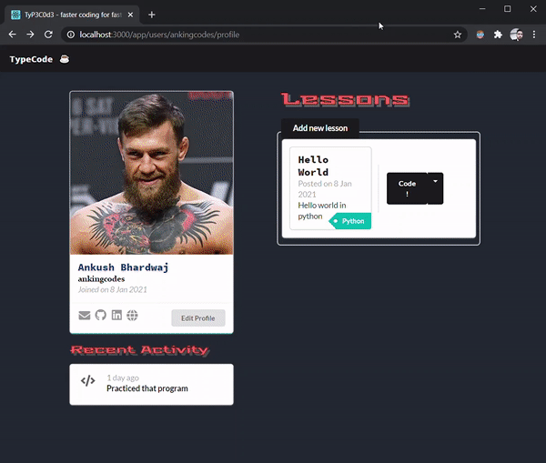

### The ultimate typing platform for programmers.



Most typing platforms simply present stories or random words to practice which works well for average people but not for the lethal, fast, perfectionist programmers who cannot afford to be slow and have typos when they code.

### Features of TypeCode
- Type actual code while practicing
- Choose any of the default type coding lessons or upload a lesson of your own.
- TypeCode doesn't just point out your typos but forces you to rectify them.
- Provides detailed analysis such as heatmaps and graphs to improve your touch typing and speed.

## CONTRIBUTING
### Installation
- Fork this repository & clone it.
```
git clone https://github.com/ankingcodes/typecode.git
```
- Type `npm install` or `yarn install` to install all packages required for the client & server.
- Make sure you have MongoDB installed, type `sudo service mongodb start` to start it on your local machine.
- Run `npm run dev` in the project folder to start the client server & backend server.
- If you like the project, hit the star button. 

